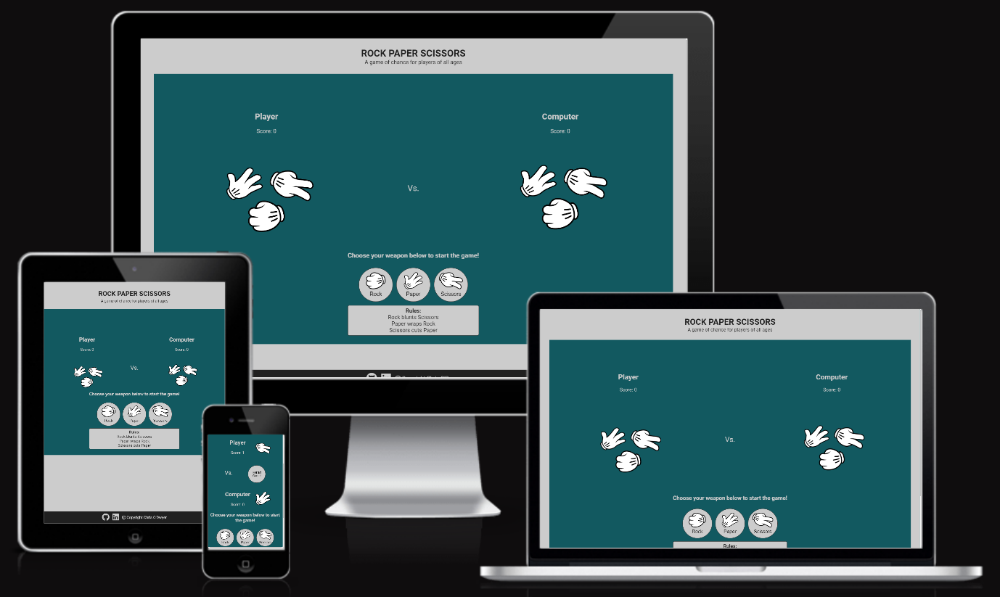
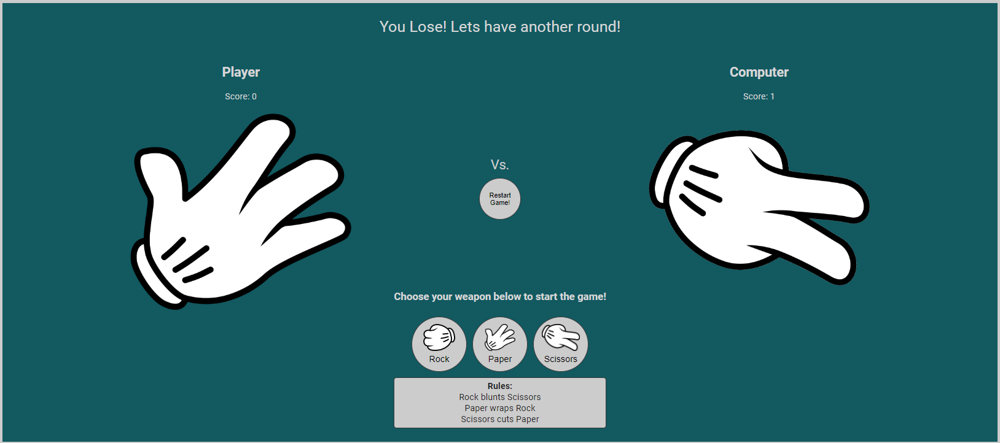
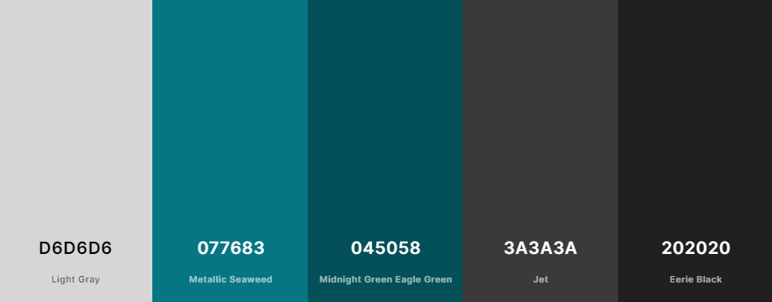
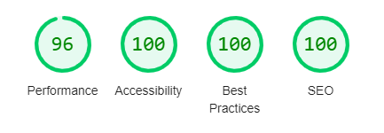
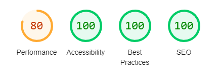

# Rock Paper Scissors
This website was designed and developed as a simple game that can be enjoyed by people of all ages. The game is something that most people would have played when they were children and the ability to play against a computer allows the user the freedom to play on their own.

To play the game is very simple with a player needing to select one of the three possible choices - Rock, Paper or Scissors to start the game, and then the computer randomly chooses its option. 

The live website on Github pages can be accessed at the following link: [View my Live Website on Github Pages here](https://christo107.github.io/CI-PP-02-Rock_Paper_Scissors/)

## CONTENTS

* [Introduction](#rock-paper-scissors)

* [Sections and Pages](#sections-and-pages)
    *  [Header](#header-and-navbar)
    *  [Game Area](#game-area-section)
    *  [Footer](#footer)
* [User Experience](#user-experience)
    *  [User Stories](#user-stories)
* [Design](#design)
    *  [Colour Palette](#colour-palette)
    *  [Typography](#typography)
    *  [Imagery](#imagery)
    *  [Wireframes](#wireframes)
    *  [Accessibility](#accessibility)
* [Technologies Used](#technologies-used)   
    *  [Languages Used](#languages-used)
    *  [Frameworks, Libraries and Programs Used](#frameworks-libraries-and-programs-used)
* [Testing](#testing)
    * [Validator Testing](#validator-testing)
    * [Responsiveness Testing](#responsiveness-testing)
    * [Accessibility Testing](#accessibility-testing)
    * [User Story Testing](#user-story-testing)
* [Bugs](#Bugs)
* [Deployment](#deployment)
* [Credits](#credits)
* [Acknowledgements](#acknowledgements)

## Sections and Pages

### Existing Sections
- #### **Header**
    - The header contains the logo(name of the game) in a simple easy to read font to announce what the game is to the user.
    - A subtitle also provides a description of the game and who the game is suitable for.

[Header Image](./assets/images/readme_images/header_area.png)

- #### **Game Area Section**
    - This section contains the main game elements. The player can choose their 'weapon' from the three options and ultimately try to win points. It is divided in to a result announcement section, the scores area, player and computer choice area and finally the controls area.
    - At the top of the game area, there is space for the result announcement of the winner of each round. This is blank by default, but javascript code runs with the following messages depending on the result - "You Win! Let's have another round", "You lose! Let's have another round" and "It's a draw! Let's have another round". The message encourages the user to continue playing regardless of the outcome of each round.
    [Result area image](./assets/images/readme_images/results_area.png)
    - Beneath this, the choice area for both the player and computer is shown, with the player area on the left, and computer on the right. The choice area consists of the user header, the current score and an image of their currently selected choice.(On initial load, an image of the 3 options is displayed as a placeholder before the first choice is made). The JS script changes the image depending on the choice that is made from the control area below.
    [Player area image](./assets/images/readme_images/player_area.png)
    - At the base of the game area is the controls and rules section. A message instructing the player to make a choice is shown to direct the user how to start the game. Below this, three circle buttons are displayed with a thumbnail image of each option and its corresponding name.
    - Underneath the controls area is a small container displaying the simple rules to the player. They are always displayed for usability and reference.
    [Controls area image](./assets/images/readme_images/controls_area.png)
    - Once the player or computer reaches 10 points, a GameOver modal is displayed congratulating or comminserating with the player. Buttons are displayed where the user can either restart the game or exit the game. Restarting triggers the reset function which clears current scores and resets choice images to the default. Exit game closes the modal and resets with a message in the results area inviting the user to come back soon and instructing that they can now navigate away from the website.
    [Game Over Modal](./assets/images/readme_images/win_game_modal.png)

- #### **Footer**
    - This section is simple and only contains links to the developer's Github repositories and linkedin pages. It also contains a copyright notice and the name of the developer. All links open in a new tab.

[Footer section image](./assets/images/readme_images/footer_area.png)

### Future Features

- #### Gameover modal
    - This feature will occur when either the player or computer reaches 10 points. At that point, a modal will appear congratulating the winner and invite the player to either play again or exit the game. 
    - This feature is currently not included due to a known bug that is blocking the modl from appearing.

## User Experience

### User Stories

#### Client Goals
- I want the game to be responsive so that is able to be played on multiple devices including laptops, tablets and mobile
- I want the game to be straightforward with clearly understandable instructions to avoid confusion
- I want the game to be accessible to all with clear text, imagery and image descriptions where appropriate

#### User Goals
- As a User I want to know what the game is when I first arrive on the site so I can decide if I want to play
- As a User I want be able to read the rules of the game easily so I understand what I have to do to play
- As a User I want to know how to start the game so I can enjoy playing
- As a User I want to be able to reset the game at any point so I can try again to win
- As a User I want to be able to exit the game at any point when I have played enough

## Design

### Colour Palette
- The colour palette was chosen to provide a simple easy to view interface for the game. Only one signature colour was used to avoid any unnecessary clash of colours with a lighter shade added for the press button effect.

### Typography
- The Roboto font was used throughout the website, being an accessible sans-serif font face, making the website easy to read for all visitors.

### Imagery
- All imagery for the website was downloaded from (https://www.pinclipart.com) which provide free to use images. Credits for the images are listed in the credit section below and in the names of the images used.

### Wireframes
- I designed the website firstly through hand drawn sketches that were then turned into basic wireframes on Figma, before being made into high fidelity wireframes.

- [Desktop Wireframe](./assets/images/readme_images/wireframes/desktop_wireframe.png)
- [Tablet Wireframe](./assets/images/readme_images/wireframes/tablet_wireframe.png)
- [Mobile Wireframe](./assets/images/readme_images/wireframes/mobile_wireframe.png)
- [Desktop High Fidelity Wireframe](./assets/images/readme_images/wireframes/desktop_high_fidelity.png)
- [Tablet High Fidelity Wireframe](./assets/images/readme_images/wireframes/tablet_high_fidelity.png)
- [Mobile High Fidelity Wireframe](./assets/images/readme_images/wireframes/mobile_high_fidelity.png)

### Accessibility
- The website was designed and developed with accessibility in mind using colours that conform to the minimum 4.5:1 colour contrast ratio as per the WCAG 2.0 level AA Guidelines
- Semantic HTML elements allows for easier navigation of the website
- Alt text has been added to all non-decorative images used on the website
- Font style used is simple and easy to read for all users.

## Technologies used

### Languages used
- HTML5
- CSS3
- Javascript

### Frameworks, Libraries and Programs used
- [GitHub](https://github.com)
- [Gitpod](https://gitpod.io/workspaces)
- [Figma](https://www.figma.com/)
- [Optimizilla Image Compressor](https://imagecompressor.com)
- [Fontawesome](https://fontawesome.com/)
- [Am I Responsive](http://ami.responsivedesign.is/)
- [Coolers.co](https://coolors.co)
- [Chrome Dev Tools](https://www.google.com/intl/en_ie/chrome/)
- [A11y color contrast validator](https://color.a11y.com/Contrast/)
- [Favicon.io](https://favicon.io/)

## Testing
The website was tested for markup and CSS validation, responsive design and accessibility using multiple browsers including Chrome, EDGE, and Firefox.
The W3C Markup validator retuned several erros on the 3rd September when tested. This included an error for a disallowed element present within a unordered list, an incorrect value for the width of an iframe, and a bad value for an input type on the booking form. These were all rectifiedin order to pass validation, as shown below. On CSS validation on the 8th September, an incorrect value was present in the grid rows style of the About us Card grid element. This was rectified to achieve oa pass on the validation. Please see screenshots of the previous results below:
- [W3C Markup Result](https://validator.w3.org/nu/?doc=https%3A%2F%2Fchristo107.github.io%2FCI-PP-02-Rock_Paper_Scissors%2F) 
- [W3C CSS Validator Result](https://jigsaw.w3.org/css-validator/validator?uri=https%3A%2F%2Fchristo107.github.io%2FCI-PP-02-Rock_Paper_Scissors%2F&profile=css3svg&usermedium=all&warning=1&vextwarning=&lang=en)

### Validator Testing
- HTML
    - Before final deployment, no errors were returned when passing through the offical [W3C validator](#)
- CSS
    - Before final deployment, no errors were found when passing through the official [(Jigsaw) validator](#)
-Javascript
    - The javascript code was run through jshint to check for any errors. Thankfully, no errors were identified. 

### Responsiveness Testing
- The website was tested for responsiveness using the Chrome and Firefox browsers and their associated Developer Tools. 
#### Chrome
- A variety of screen sizes were checked for responsiveness using the Developer tools from 4K displays at 2560px wide, laptop sizes 1440px and 1024px, tablets at 768px, and a variety of mobile sizes down to 320px width. All elements maintained functionality and visibility in all scenarios. Real world testing was also conducted on physical devices of various sizes to ensure integrity. No issue was encountered on these.
- A Lighthouse report was run several times to gauge the performance, accessibility, best practice and SEO scores. 

 - 
 - 

### Accessibility Testing
- Multiple tests were run on the website using Lighthouse and A11y Color Contrast Accessibility Validator to examine any accessibility issues. https://color.a11y.com/
#### Firefox
- Firefox's built in colour blindness simulator was used to identify any areas where sufficient colour contrast was not present. No such areas were found.

### User Story Testing
- I used the user stories to perform manual testing on the game to see whether there were any blockers to the user goals identified above. These are the results:

#### Client Goals
1. I want the game to be responsive so that is able to be played on multiple devices including laptops, tablets and mobile
    * The game was checked on multiple devices for responsiveness. There was an issue on small mobile devices where content overlapped but this was addressed and fixed. The game displays adequately on all size devices tested.
2. I want the game to be straightforward with clearly understandable instructions to avoid confusion
    * The game contains easy to understand instructions on how to start the game and how you win points. The instructions are displayed throughout the game for easy access.
3. I want the game to be accessible to all with clear text, imagery and image descriptions where appropriate
    * The font, imagery and layout provide the user with a clean and ncluttered interface in which to play the game. alt tags have been added to images, and the colours used exceed the requirements for colour contrast as confirmed by tests performed on A11y.com website checker.
    
#### User Goals
1. As a User I want to know what the game is when I first arrive on the site so I can decide if I want to play
    * The clear game title at the top of the page and example imagery present in the game area demonstrates what the game is and what it will involve
2. As a User I want be able to read the rules of the game easily so I understand what I have to do to play
    * The game rules section underneath the controls area are visible all the time so the user is able to read and understand them before and while playing
3. As a User I want to know how to start the game so I can enjoy playing
    * The instruction message above the controls area shows the user how to start the game by choosing one of the options
4. As a User I want to be able to reset the game at any point so I can try again to win
    * Once the game commences, a restart button appears in the centre of the screen to be cearly visible and easiliy accessible for the user to restart the game at any point.
5. As a User I want to be able to exit the game at any point when I have played enough
     * There are no blockers for the user to exit the game at any point. There are no popups to dissuade the user from leaving when they choose to do so.

## Deployment
I used Gitpod to develop the website and the site was deployed using GitHub Pages. Please see details below:

- The steps to deploy are as follows: 
    - In the GitHub repository (https://github.com/Christo107/CI-PP-02-Rock_Paper_Scissors), navigate to the Settings tab 
    - On the left hand side, locate the Pages section
    - From the source section drop-down menu, select the main branch and save
    - Once the main branch has been selected, the page will be automatically refreshed with a detailed ribbon display to indicate the successful deployment. 

- It can also be forked via the following steps:
    - Log in to GitHub and locate the repository again, as described above.
    - At the top right corner of the repository, you will see a "Fork" button. Click on it.
    - You will then be asked where you want to save it, so choose a location.
    - You now should have a copy of this repository in your own GitHub account.

The live link can be found here - https://christo107.github.io/CI-PP-02-Rock_Paper_Scissors/

## Bugs
### Fixed Bugs
- Overlapping Content Bug: This bug appeared on small mobile devices where the computer choice area was overlapping the controls area. This was fixed by adjusting the margin of the controls area to position it further down the page.
[Overlapping Content Bug](./assets/images/bugs/overlapping_%20content_bug.png)
- GameOver modal was not appearing when either the player or computer reached the maximum 10 points. The cause was identified as the function was being called in the wrong place. The gameover modal now displays as below:
[Winning Game Over Modal Image](./assets/images/readme_images/win_game_modal.png)

### Known Bugs

## Credits

### Code

- Some game javascript code was based on Code Institute's Rock Paper Scissors example. See code comments for details of which code segments this applies to.
- Some game javascript code was based on Code Institute's Love Maths example. See code comments for details of which code segments this applies to.
- Several tutorials on developing a Rock Paper Scissors game were viewed but no code was used directly from these tutorials and were used solely for inspiration on ho to implement the game. The tutorials were as follows:
    * Web Dev Simplified https://www.youtube.com/watch?v=1yS-JV4fWqY
    * Code with Ania Kubow https://www.youtube.com/watch?v=RwFeg0cEZvQ

### Content

- The text content of the website was written by the developer.
- The social media icons in the footer were taken from [Font Awesome](https://fontawesome.com/)

### Media

- The imagery used in the game was taken from (https://www.pinclipart.com/) and is free to use.

## Acknowledgements
 - My mentor for his advice and assistance
 - The CI students who peer reviewed my website and gave feedback